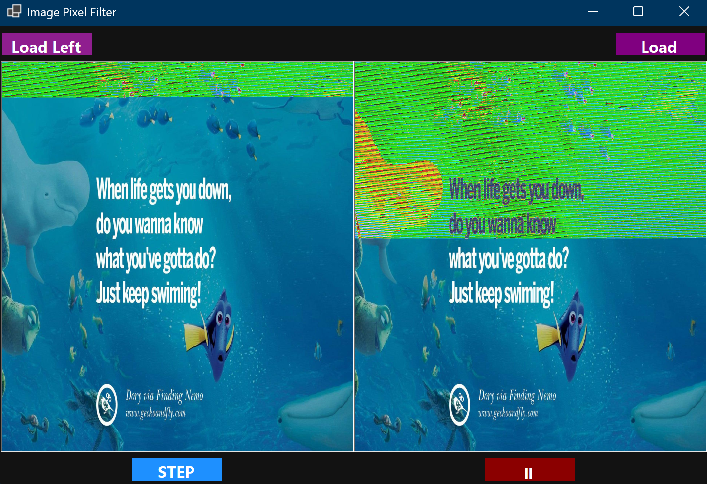

# ImagePixelFilter
---
A C# WinForms application that demonstrates **pixel-by-pixel image processing** using `Bitmap.GetPixel` and `Bitmap.SetPixel`.  The app allows you to load two images and apply a color transformation effect either **step-by-step** or **automatically with animation**, making it useful for learning image processing basics and UI timers in WinForms.
---
## ✨ Features

- Load two separate images (Left & Right)
- Step-based pixel processing for manual control
- Automatic animated pixel processing using a timer
- Real-time visual feedback
- Clean dark-themed UI
- Demonstrates Bitmap pixel manipulation in C#

---

## 🖼 How It Works

- **Left Image**
  - Processed manually using the **STEP** button
  - Each click modifies a batch of pixels

- **Right Image**
  - Processed automatically using **Start / Pause**
  - Uses a timer to continuously update pixels

Each pixel’s RGB values are transformed based on its index, creating a dynamic color effect.

---

## 🛠 Technologies Used

- C#
- .NET (WinForms)
- System.Drawing
- Bitmap pixel manipulation
- Windows Forms Timer

---

## 🚀 Getting Started

### Requirements
- Windows
- .NET 6 or newer
- Visual Studio 2022+

### Run the App
1. Clone the repository
   ```bash
   git clone https://github.com/your-username/ImagePixelFilter.git
   ```
   ---
   ## 🖼 Output Preview



